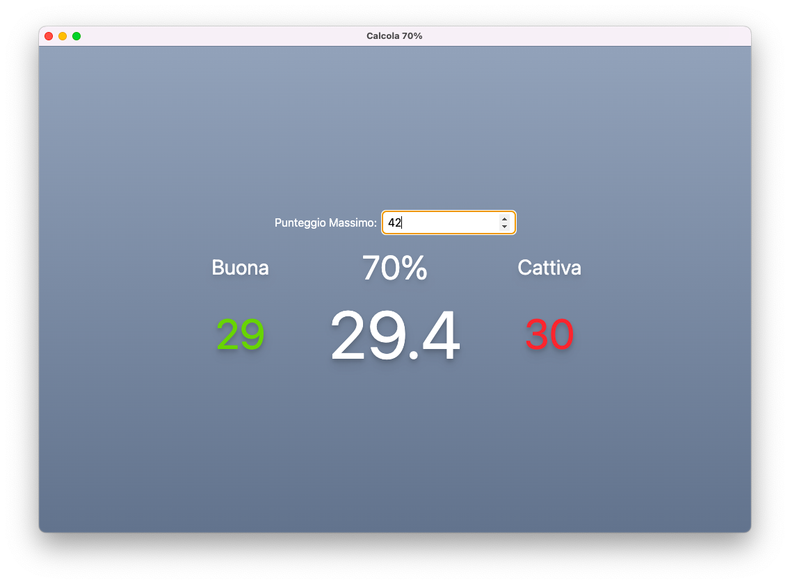

# 70% Calculator

> An under-featured and over-engineered calculator.

`disclaimer: the text is in italian :p`

## Who? What? Why?

My mother is a high school teacher and during tests/exams she needs to caluclate the 70% of the max score to define a passing threshold.

I thought it would be funny to have a custom made app to do that.

She loves it :)

## How?

I made this using [Electron React Boilerplater](https://github.com/electron-react-boilerplate/electron-react-boilerplate), and TailwindCSS, obviously using TypeScript (but GitHub already tells you that)

## Downloads

Should you want to download a build, please check out the releases.
